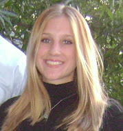

= Katie Resler Newsham
// data-uri - embed image in resume 
:data-uri:

:frame: none
:grid: none 
[cols="1,5a",width"20"]
|===================================================================================================
|  |
[horizontal]
Location:: Chesapeake, Virginia
Email:: mailto:katie.r.newsham@gmail.com[Katie.R.Newsham@gmail.com]
|===================================================================================================

*PROFESSIONAL EXPERIENCE*

*Summary*

Nuclear Shift Test Engineer, Norfolk Naval Shipyard, 09-2014 to Present +
Assistant Shift Test Engineer, Norfolk Naval Shipyard, 02/2012 to 09/2014

* As Shift Test Engineer, I am responsible for the safety of a nuclear reactor plant. 
* I have the technical expertise required to balance the requirements of reactor safety, the authorization of reactor plant work, and the testing subsequent to work completion. 
* I am a leader who plans, coordinates, and supervises testing and major plant condition changes performed in the reactor plant.

.*Engineering Experience*
* Develop, review, and execute procedures for establishing safe conditions for maintenance work.
* Authorize maintenance after verifying proper isolation and safe conditions have been established.
* Concur on non-nuclear maintenance items affecting reactor plant operations.
* Track and control simultaneous tests, operations, and work release.
* Analyze test data to ensure satisfactory performance of retests.

.*Supervision Experience*
* Supervise watch team to ensure safe maintenance of plant conditions during overhaul.
* Lead, coordinate, and direct reactor plant operations and test procedures.
* Responsible for the progress and safety of the nuclear test program during assigned shift.

.*Communications Experience*
* Brief senior-level personnel on problems encountered during testing and proposed corrective actions.
* Train and prepare Ship’s Force and Shipyard personnel to execute reactor plant tests, major plant condition changes, and maintenance. 
* Coordinate with Ship’s Force, Radiological Controls, and Production personnel to plan and execute reactor plant evolutions.
* Maintain detailed log of tests and operations to provide a lasting record of the test program.

*EDUCATION*

B.S. Chemical Engineering +
University of Missouri +
Magna cum Laude

*PROFESSIONAL DEVELOPEMENT*

*Society of Women Engineers*::
* Hampton Roads Section Secretary, 2012 +
* Hampton Roads Section Member, 2011 to Present

Fundamentals of Engineering Exam, 2010 +
Graduate Record Examination

*SKILLS and ATTRIBUTES*::
* Integrity
* Multi-tasking
* Problem Solving
* Leadership
* Detail-Oriented
* Self-Motivated
